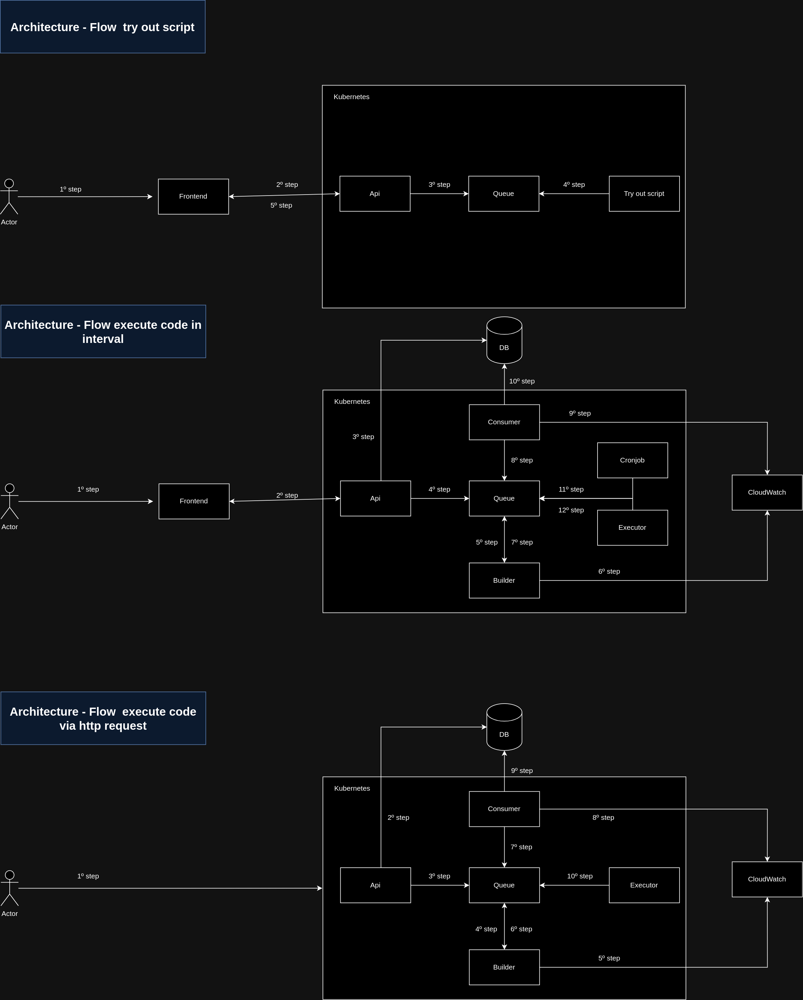

## ABOUT

The project start when I was creating another project to notify me about new episodes the podcasts I listen and for build that project I used Pipedream where give possibility to create a piece of code in nodejs where I can use third libraries in that it. So, I starting ask me how can I create solution like that, where i can run piece of code use third libraries.

The project is final result the solution i created to do same.

## FEATURES
- Create code to execute in specific interval(like cronjob).
    - Allow add third libraries
    - Allow using credentials or sensitive data using Infisical.
    - Can see the execution logs 
- Create code where is triggered via http request.
    - Allow pass request body data to code will execute.
    - Allow add third libraries.
    - Allow using credentials or sensitive data using Infisical. 
    - Can see the execution logs 
- Try out your code before save.

## TECHNOLOGIES

- Node.js
- Javascript
- CockroachDB
- Bullmq + redis(Queue)
- Cloudwatch(save logs of applications)
- Docker
- Docker hub(place where i save the codes)
- Terraform(to create infrastructure)
- Kuberentes(to run applications)
- Github actions(to automate process to build and deploy each part of application)
- DigitalOcean(I used container registers and kubernetes services)
- Next.js(frontend)

## THE PROJECT STRUCTURE

- api            -> Where you find code to save piece code, cronjob to define what piece of code needs to run and consumers where listen events.
- frontend       -> The view part of application.
- builder        -> The project responsable to build docker image the piece of code and publish in docker hub.
- executor       -> The project responsable to execute piece code.
- try-out-script -> The project allow to try out script before save it.
- infra          -> Where you find terraform script and kubernetes scripts.
    - k8s        -> Where you find kubernetes scripts to put application to run k8s.
    - terraform
        - cloudwatch -> terraform script to create cloudwatch resources.
        - k8s        -> terraform scripts to create container registry and kubernetes in DigitalOcean.

## ARCHITECTURE

### Flow try out script

- 1º step: access frontend app.
- 2º step: send request to try out script to api.
- 3º step: send data to queue.
- 4º step: get message, build docker container, execute code and return output.
- 5º step: api get output returned and return response for frontend.

### Flow execute code in interval

- 1º step: access frontend app.
- 2º step: send request to api.
- 3º step: create register database.
- 4º step: send data to queue.
- 5º step: get data and build docker image with code.
- 6º step: send logs to cloudwatch.
- 7º step: send data to queue to notify docker build finished.
- 8º step: get message.
- 9º step: send logs to cloudwatch.
- 10º step: set script is ready to start to execute.
- 11º step: get all scripts enabled and interval execution more and equal than time setted and publish to queue.
- 12º step: execute all codes.

### Flow execute code via http request

- 1º step: make request using unique url to trigger the code.
- 2º step: create register database.
- 3º step: send data to queue.
- 4º step: get data and build docker image with code.
- 5º step: send logs to cloudwatch
- 6º step: send data to queue to notify docker build finished.
- 7º step: get message.
- 8º step: send logs to cloudwatch.
- 9º step: set script is ready to start to execute.
- 10º step: if script is ready, send message to queue, executor get message and execute code.

## DATABASE

